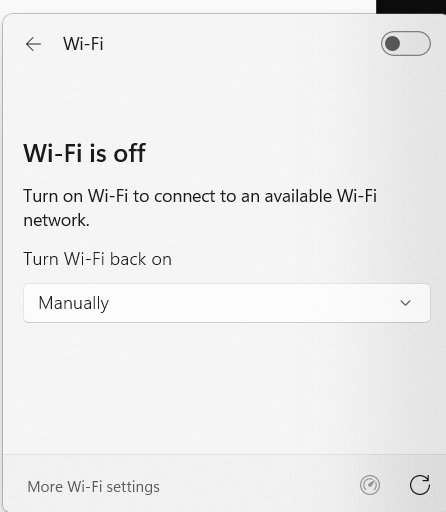
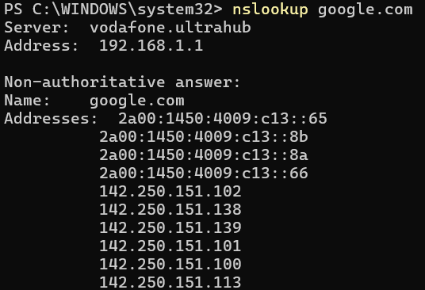

# Troubleshooting: Windows No Internet Connection

## Scenario

A user reports that they are unable to access the internet from their Windows workstation.

The objective was to identify the cause of the connectivity issue, restore network access and verify that both internet connectivity and DNS resolution were functioning correctly.

## Initial Baseline

Before introducing the fault, the workstation had a working network connection.

Baseline checks confirmed:

- IPv4 connectivity was configured correctly.
- A default gateway was present.
- External connectivity to `8.8.8.8` was successful.
- DNS resolution for `google.com` was successful.

This established that the workstation, network connection, internet connectivity and DNS were initially functioning normally.

## Fault Introduced

The workstation's Wi-Fi connection was disabled to simulate a user reporting that they had lost internet access.



The Windows network settings confirmed that Wi-Fi was switched off.

## Investigation

### 1. Test external connectivity

The following command was used:

```powershell
ping 8.8.8.8

Result:

4 packets sent
0 packets received
100% packet loss
PING: transmit failed. General failure.

This confirmed that the workstation could not communicate with the external IP address.

**2. Test DNS resolution**

The following command was then used:

nslookup google.com

The lookup failed because the workstation did not have an active network connection to its DNS server.

This demonstrated that DNS resolution was also unavailable.

## Diagnosis

The immediate cause of the incident was that the workstation's Wi-Fi adapter had been disabled.

Because there was no active network connection:

**Workstation → Wi-Fi → Router → Internet**

The workstation could not reach the router or external network resources, meaning both external connectivity and DNS resolution were unavailable.

## Resolution

Wi-Fi was switched back on and the workstation was reconnected to the wireless network.

Connectivity was then tested again to confirm that the issue had been resolved.

## Verification

### Internet connectivity

The following command was used:

`ping 8.8.8.8`

The workstation successfully received replies from `8.8.8.8`, confirming that external network connectivity had been restored.

### DNS resolution

The following command was used:

`nslookup google.com`

The DNS server responded successfully and returned multiple IP addresses for `google.com`.



This confirmed that both internet connectivity and DNS resolution were functioning correctly after the fix.

## Key Learning

This exercise demonstrated the importance of following a structured troubleshooting process rather than immediately assuming that an internet outage is caused by the ISP or router.

Testing an external IP address with `ping` helped separate basic network connectivity from DNS resolution, while `nslookup` confirmed whether domain-name resolution was working.

The incident followed a simple troubleshooting process:

**Identify the problem → Test connectivity → Test DNS → Identify the cause → Restore the connection → Verify the fix**

This approach can be applied to similar first-line IT support incidents involving users reporting loss of internet access.
